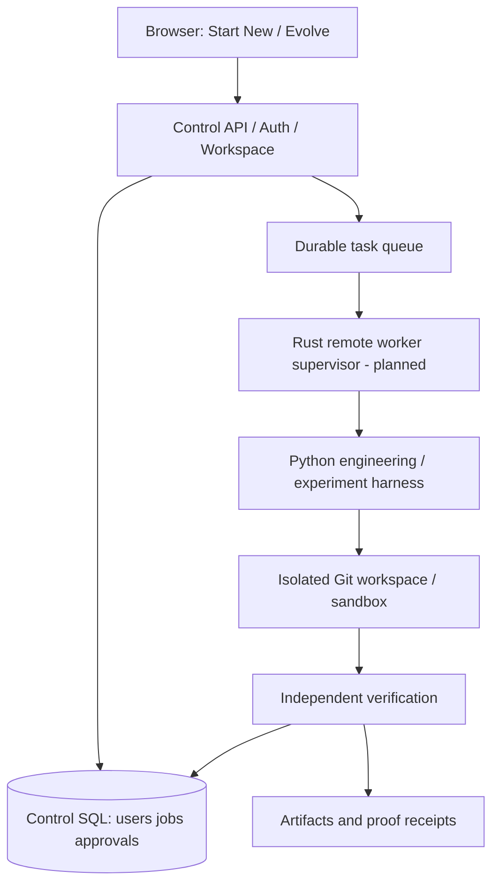

# Technical architecture and component choices

## Architectural principle

Keep three replaceable planes: **control**, **intelligence**, and **execution**. Every external provider should sit behind a versioned adapter. Start with a small single-host implementation, then distribute only where measured demand justifies complexity.

## Current known implementation

**Public site:** static dependency-free HTML/CSS/JavaScript at preview/index.html, hosted on Vercel. Interaction is explicitly illustrative; no OAuth or agent API.

**Earlier local MVP:** FastAPI backend, session-oriented GitHub identity OAuth implementation awaiting credentials, SQLite users/projects/jobs, project scaffolding/ZIP export, basic repository snapshot analysis, separate Python job worker and small ML evaluation tasks. This full local source was not yet published to the remote GitHub repository as of 2026-10-09. Its local test results are not production QA.

## Planned production control plane

- React + TypeScript frontend, Soft Modern theme, accessible components.
- Hono/TypeScript API, Better Auth GitHub identity, GitHub App for repository access.
- SQL metadata store: Cloudflare D1/Drizzle for low-cost hosted mode, SQLite/PostgreSQL adapters for self-hosting and higher write concurrency.
- Durable job table + Cloudflare Queues/Cron or replaceable orchestration layer.
- APIs for organizations, sessions, projects, specs, repos, tasks, permissions, approvals, worker leases and evidence.

## Planned execution plane

Rust with Tokio + Axum, Serde, SQLx, Tracing/OpenTelemetry, deterministic task-state machine, quotas, leases, retries, cancellation, checkpoints and isolated worktrees. Launch untrusted builds with hardened container/microVM boundaries appropriate for tenant threat level. Rust runtime is a **proposal**, not yet built.

## Planned intelligence plane

Python research/coding harness, scikit-learn/AutoGluon/CatBoost/LightGBM/XGBoost/Optuna for ML benchmarks; Tree-sitter/language tools for code structure; prompt/model adapters to Ollama/llama.cpp/vLLM and optional customer-configured providers; policy engine, verifier, versioned context retrieval and memory.

## Data flows

Start New: authenticated brief → persisted specification/plan → approved task DAG → sandbox workspace → code/test/build → evidence artifacts → reviewable source/PR → user-approved deployment.

Evolve: authorized repo snapshot → architecture map + static/runtime diagnostics → ranked opportunities → bounded change in isolated branch → independent tests → review/PR → measured result.

## Architecture diagram

## Key boundaries

Models cannot grant permissions. Repository content is untrusted input. Local SQLite is not a shared cross-host WAL database. Database rows are not storage for model weights and large logs. One $0 VM cannot guarantee unlimited agents, GPU time, or enterprise uptime.
