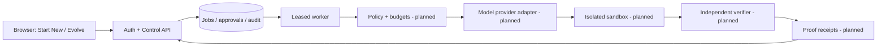

# Enterprise-first AI engineering architecture

**Scope:** Release gates for Oryveta's Start New and Evolve workflows. Proposed components are not shipped features; this document is not a claim of enterprise certification.

## Invariants

1. **Separate control, intelligence and execution.** The API owns identity, policy, budgets and job state. Untrusted repository commands must run in isolated, disposable sandboxes, never in the API process.
2. **Models cannot grant permissions.** Every tool capability is explicitly allowed, approved where needed, and scoped to the authenticated account, repository and operation. Repository text and model output are untrusted.
3. **Independent verification is mandatory.** The code-writing agent cannot certify its own output. Use externally specified tests, held-out evaluations, reproducible artifacts and proof receipts.
4. **Every task has bounds.** Per-user admission, execution deadline, token and compute budget, retry limit, artifact limit and explicit cancellation.
5. **Every action is traceable.** Record correlation IDs, code revision, model/tool versions, approval, budgets, tests and evidence. Do not log secrets or sensitive prompts by default.
6. **Every state change is durable and idempotent.** Lease fencing prevents stale workers from publishing; transactional event writes prevent orphaned activity records. External side effects need reconciliation before retries.
7. **Portability beats premature distribution.** Begin with Python/SQLite on one host; introduce PostgreSQL, distributed queues, Rust, Kubernetes or GPUs only after workload measurements justify them.

## Architecture

**Implemented or proposed in this milestone:** single-host SQLite job admission, authenticated status, owner-only cancellation, fenced lease heartbeats, atomic job/event creation, existing local source analysis and read-only Evolve patch previews.

**Implemented in this change:** an opt-in local Ollama text-generation adapter and SQLite per-user token reservations. No model is deployed or exercised against a live inference server by CI.

**Not implemented:** production AI coding agent, hard sandbox isolation, GitHub App writes, distributed orchestration, cost billing, enterprise RBAC, independent runtime verification or cryptographic proof receipts.

## Enterprise AI release gates

| Foundation | Required contract | Proof before enabling |
| --- | --- | --- |
| Model adapter | Versioned provider interface, structured tool calls, timeouts, retry taxonomy | Two swappable providers; deterministic mock tests |
| Security | Explicit capability allowlist, secrets isolation, GitHub App least privilege | Prompt-injection and authorization adversarial tests |
| Sandbox | Ephemeral filesystem, non-root, CPU/memory/wall limits, controlled egress | Escape/egress tests, kill and cleanup on timeout |
| Evaluation | External acceptance tests and independent reviewer | Held-out success metrics and regression rejection |
| Human approval | Scope-matched approval for push, PR, deploy and destructive changes | No side effect without approval |
| Cost controls | Token/compute limits, parallelism quotas, circuit breakers | Budget exhaustion hard-stop tests |
| Observability | Correlation IDs across API, worker, model, tools, verifier | End-to-end traces without credentials |
| Tenant isolation | Organization/workspace scoped data and artifacts | Cross-tenant SQL, storage and queue tests |
| Operations | Backup/restore, rollback, reproducible deploy | Restore drill and canary rollback |
| Delivery | CI, dependency audit, code review, artifact provenance | Required checks green before merge |

## Task state and current limitations

Current lifecycle: `queued → running → succeeded | failed`; `queued | running → canceled`. A worker has a unique lease token, renews it while busy and can commit results only with an unexpired matching token. Cancellation revokes the token atomically, preventing late results or retries. **Running computation can still finish in-process**: this is a persistence fence, not hard termination. Never execute untrusted code until a killable sandbox with a hard deadline exists.

A user can have at most **8 queued/running jobs** on the current single-host API. New requests over quota return `429` and `Retry-After: 30`. Matching benchmark idempotency replays work at capacity. Initial imported project and analysis job are inserted atomically, avoiding orphan rows on quota rejection. Job admission and activity records share a transaction.

- `GET /api/jobs/{job_id}`: sanitized, owner-only status; no lease tokens.
- `POST /api/jobs/{job_id}/cancel`: owner-only, CSRF-protected; idempotent if already canceled; terminal success/failure returns `409`.

## What to measure

- **Reliability:** queue wait p50/p95, completion rate, retry and expired lease rate, cancellation latency, worker recovery.
- **AI quality:** held-out verified success rate, regressions, cost per verified outcome, verifier agreement.
- **Security:** cross-tenant denials, tool permission violations, secret leaks, sandbox escapes.
- **Economics:** tokens, CPU/GPU seconds and storage per task and per tenant.
- **Operations:** latency p95/p99, database contention, backup restore time, rollback time.

Scale only when evidence demands it: shared SQL for multi-host writes, a durable queue for host-loss recovery, multiple isolated workers for actual parallel demand. Green CI is necessary but not a load test, SLA or security certification.

## Next implementation order

1. Job quotas, heartbeat, cancellation, owner isolation and atomic activity (**this change**).
2. Provider-neutral, text-only local model interface and durable per-account token budgets (**this change**). Tool permission policy, per-task compute budgets and a killable executor are still pending.
3. Disposable, killable sandboxes and egress controls.
4. Independent verifier and content-addressed proof receipts.
5. GitHub App with explicit approval and idempotent PR publication.
6. Tracing, disaster recovery drills and load tests; distribute workers only when needed.

See [QUALITY.md](QUALITY.md), [SECURITY.md](SECURITY.md), [ROADMAP.md](ROADMAP.md) and [OPERATIONS.md](OPERATIONS.md).
